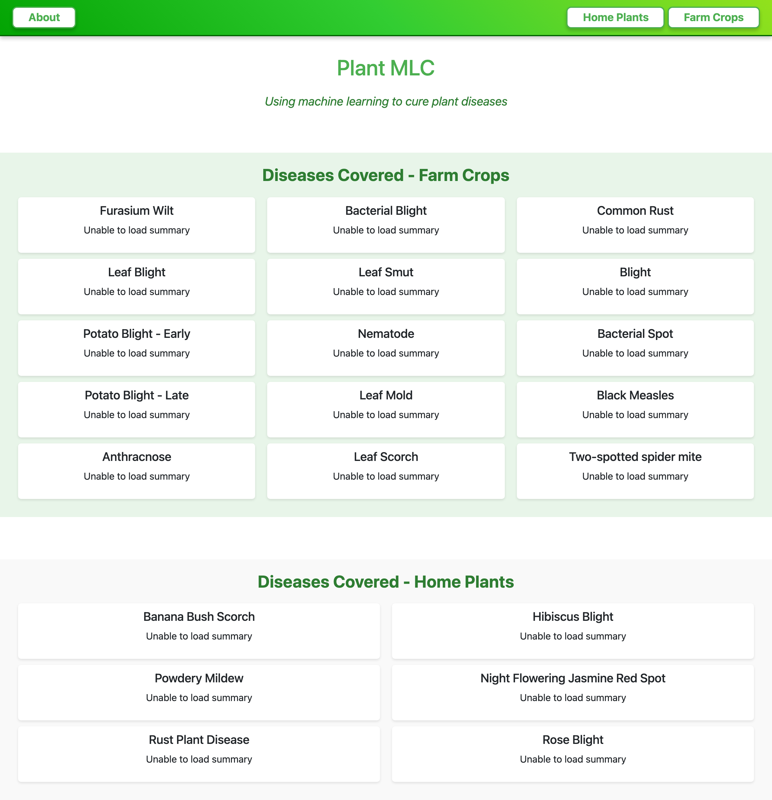
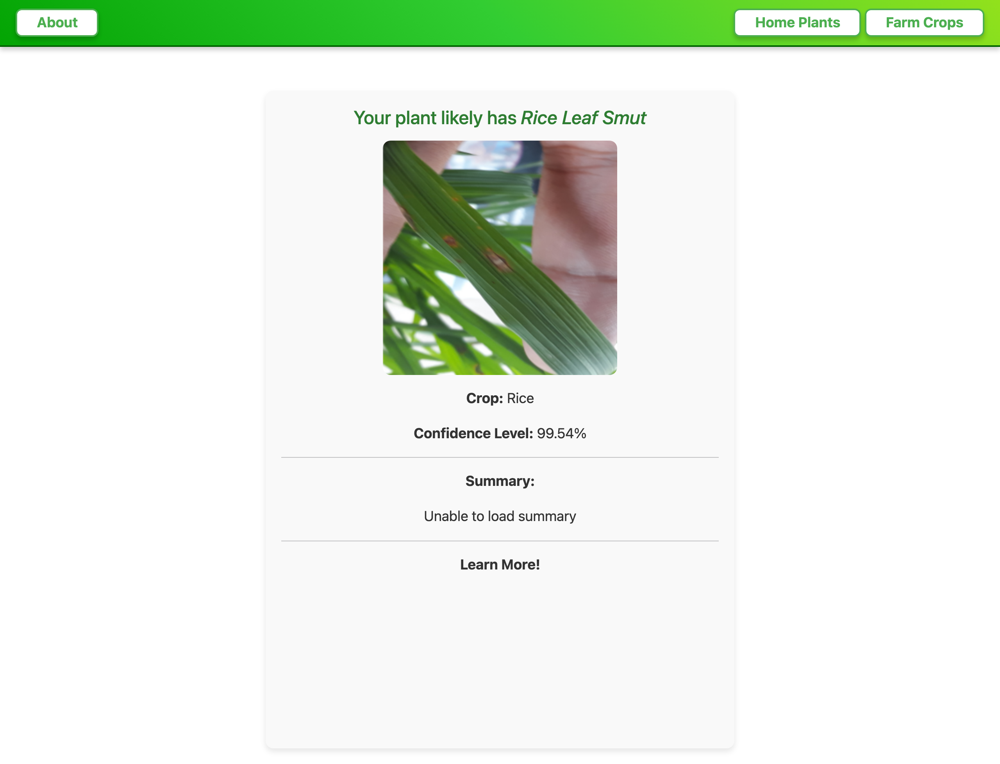
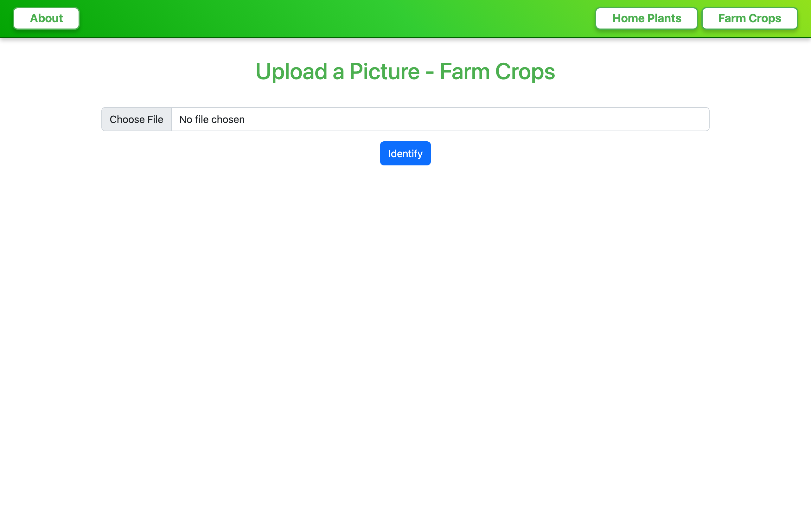

# 🌿 Plant MLC – AI Plant Disease Detector & Treatment Assistant

> An intelligent web application leveraging **Computer Vision (Keras / TensorFlow)** and **LLMs (Meta Llama 4 via Groq)** to identify plant diseases from images, evaluate confidence scores, provide treatment steps, and fetch verified educational references.

---

## 🏆 Awards & Recognition

* 🥇 **Winner – World AI Competition for Youth (2025)**  
  Recognized as a **Top 2% Global Finalist** out of **29,000+ submissions** worldwide.

* 🥉 **3rd Place – Virginia Technology Student Association (TSA)**  
  Awarded 3rd place in the statewide **Software Development Competition**.

---

## 📸 Interface & Demonstration

### 🏡 Homepage & Disease Index
Browse through all supported farm crops and home plant diseases with real-time AI summaries.


---

### 🔬 Instant AI Diagnosis & Treatment Plan
Upload any image to receive instant disease classification, confidence score, detailed treatment guidance, and credible `.edu` source links.


---

### 📤 Image Upload Workflows
Dedicated portals tailored for **Home Plants** and **Farm Crops**.
| 🏠 Home Plants Portal | 🌾 Farm Crops Portal |
| :---: | :---: |
|  |  |

---

## ✨ Features

- 🧠 **Dual Neural Network Classifiers**: Custom-trained Keras MobileNet models tuned specifically for:
  - **Farm Crops** (15 distinct disease categories)
  - **Home & Garden Plants** (6 distinct disease categories)
- 💬 **Generative AI Diagnostics**: Powered by **Meta Llama 4 Scout** (via Groq API) to generate actionable, tailored treatment instructions for diagnosed plant conditions.
- 📚 **Verified Educational Resources**: Integrated with **Google Custom Search API** (filtered to `.edu` domains) to supply peer-reviewed source links for further reading.
- ⚡ **Responsive Web Experience**: Lightweight Flask backend integrated with Bootstrap 5 for fast, clean image upload and diagnosis visualization.

---

## 🌱 Supported Plant Diseases

### 🌾 Farm Crops (15 Categories)
1. Banana Fusarium Wilt
2. Wheat Leaf Blight
3. Potato Blight – Early
4. Potato Blight – Late
5. Mango Anthracnose
6. Cotton Bacterial Blight
7. Rice Leaf Smut
8. Potato Nematode
9. Tomato Leaf Mold
10. Strawberry Leaf Scorch
11. Corn Common Rust
12. Corn Blight
13. Bell Pepper Bacterial Spot
14. Grape Black Measles
15. Tomato Two-Spotted Spider Mite

### 🏠 Home & Garden Plants (6 Categories)
1. Banana Bush Scorch
2. Powdery Mildew
3. Rust Plant Disease
4. Hibiscus Blight
5. Night-Flowering Jasmine Red Spot
6. Rose Blight

---

## 🛠️ Tech Stack

- **Machine Learning & CV**: Keras, TensorFlow, NumPy, Pillow (PIL)
- **Generative AI & LLM**: Groq API (`meta-llama/llama-4-scout-17b-16e-instruct`)
- **Search Integration**: Google Custom Search API
- **Web Backend**: Python 3.11, Flask, Flask-WTF, WTForms
- **Frontend**: HTML5, CSS3, Bootstrap 5

---

## 🚀 Quick Start & Local Installation

### Prerequisites
- Python 3.11
- Git

### 1. Clone the Repository
```bash
git clone https://github.com/JayChauhan2/DiseaseDetectorPlants.git
cd DiseaseDetectorPlants
```

### 2. Set Up Virtual Environment & Dependencies
```bash
python3 -m venv venv
source venv/bin/activate  # On Windows: venv\Scripts\activate
pip install -r requirements.txt
```

*(If `requirements.txt` is not created yet, install core dependencies manually:)*
```bash
pip install flask flask-wtf tensorflow tf_keras pillow python-dotenv groq requests
```

### 3. Environment Variables Configuration
Create a `.env` file in the root directory:
```env
GROQ_API_KEY=your_groq_api_key_here
SEARCH_API_KEY=your_google_search_api_key_here
SEARCH_ENGINE_ID=your_google_search_engine_id_here
```

### 4. Run the Application
```bash
python app.py
```
Open your browser and navigate to `http://127.0.0.1:5000/`.

---

## 📁 Repository Structure

```
DiseaseDetectorPlants/
├── app.py                  # Main Flask application & inference logic
├── forms.py                # Flask-WTF image upload forms
├── keras_model.h5          # Trained neural network model for Farm Crops
├── keras_model_house.h5    # Trained neural network model for Home Plants
├── labels.txt              # Class labels for Farm Crops
├── labels_house.txt        # Class labels for Home Plants
├── static/                 # CSS stylesheets & user upload storage
│   ├── about.css
│   └── user_uploads/
├── templates/              # Jinja2 HTML templates
│   ├── about.html
│   ├── base.html
│   ├── result.html
│   └── submit.html
├── test_images/            # Sample dataset images for quick testing
└── assets/                 # Screenshots and media assets for README
```

---

## 📄 License

This project is licensed under the MIT License - see the [LICENSE](LICENSE) file for details.
